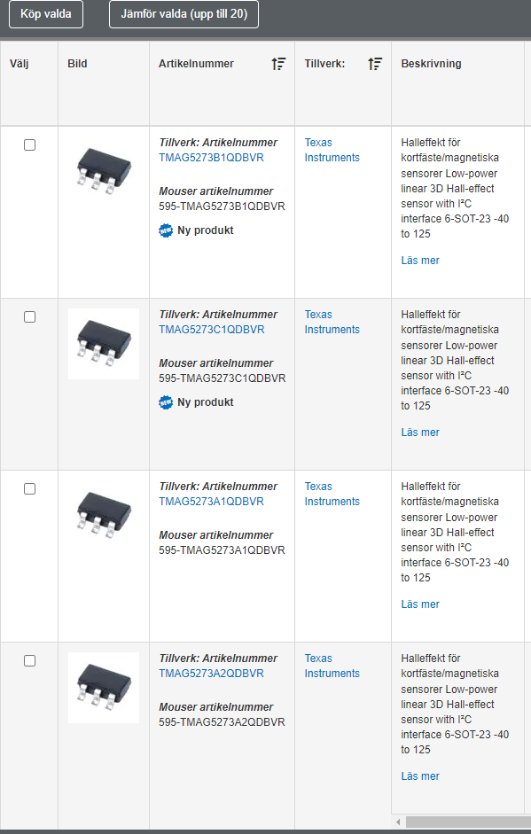

# Notes for FC-CONTROL_BOARD

## Hardware notes
### FC Control board v0.1
#### Known faults
- [ ] Wrong 3.3v regulator pinout ordered. Footprint is correct but non standard part was ordered.
- [ ] 5v from USB goes directly to regulated 5v rail (can lead to excessive current draw from/to USB). Should be separate or have reverse current protection.
- [ ] Servo pin header had wrong pinout. Should be 5v, GND, signal. Not signal, 5v, GND.
- [ ] Negative battery terminal is not connected.
- [ ] Silkscreen needs to be improved.
  - [ ] Add pinout for servo header.
  - [ ] Add pinout for battery header.
  - [ ] Label for Reset and Boot buttons needs to be fixed.
- [ ] Screw hole is under the USB connector. Connector should be moved to the side.
- [ ] Components at the back block mounting of back wing.

#### Improvements
- [ ] Improve Voltage/Current protection for USB and battery.
- [ ] Add connector with more GPIO pins for future expansion.
- [ ] Test opamp circuit for halleffect encoder. Implement on pcb if works well.
- [ ] 3.3v and 5v routing is not well done, can be improved.
## MAC address
Mac address for the board can be gotten by using `env:print-mac` and reading serial output.
```
- FC Control board v0.1: 34:85:18:5C:4E:F0
```

### FC Control board v1.1
#### Addressed issues
- [x] Changed footprint for the ESP32-S3 (easier to solder)
- [x] Servo pin header switched to GND, 5V, signal
- [x] Negative battery terminal is not connected.
- [x] Silkscreen needs to be improved. (sort of)
  - [x] Add pinout for battery header.
  - [x] Add pinout for servo header.
  - [x] Label for Reset and Boot buttons needs to be fixed.
- [x] Screw hole is under the USB connector. Connector should be moved to the side.
- [x] Components at the back block mounting of back wing.
#### Additional features
- [x] Added a buzzer
#### What's left
  - [ ] 5v from USB goes directly to regulated 5v rail (can lead to excessive current draw from/to USB). Should be separate or have reverse current protection.
  - [ ] Improve Voltage/Current protection for USB and battery.
  - [ ] Add connector with more GPIO pins for future expansion.
  - [ ] Test opamp circuit for halleffect encoder. Implement on pcb if works well.
  - [ ] 3.3v and 5v routing is not well done, can be improved.
  - [ ] Add connector for the camera
  - [ ] Add connectors for the hall-effect sensors
  - [ ] Add tail-light LED
  - [ ] Decrease bat_level measurements from reading 3.3V to 3.0V as max battery voltage (ESP32 ADC is shit)
  - [ ] Fix silkscreen text sizing


### FC Control board v1.2
#### Addressed issues
  - [x] Add connector for the camera
  - [x] Add connectors for the hall-effect sensors (https://www.mouser.se/ProductDetail/Texas-Instruments/DRV5056A2QLPGM?qs=vdi0iO8H4N3IxI89EIhQ7w%3D%3D Are tested and give a [0.1, 1.1]V range to ADC)
  - [x] Decrease bat_level measurements from reading 3.3V to 3.0V as max battery voltage (ESP32 ADC is shit)
  - [x] Fix silkscreen text sizing

#### Additional features
  - [x] Add tail-light LED

#### Improvements
  - [ ] Add IMU
  - [ ] Fix button footprints
  - [ ] Add reverse current diodes for LDOs
  - [ ] Add small switch with MOSFET to connect/disconnect battery
  - [ ] Change motor drivers
  - [ ] Add fuse for USB
  - [ ] Add undervoltage protection for the battery

### FC Control board v1.3 [WIP]
#### Addressed issues
  - [x] Add IMU
  - [x] Fix button footprints
  - [x] Add reverse current diodes for LDOs
  - [x] Add small switch with MOSFET to connect/disconnect battery
  - [x] Change motor drivers
  - [x] Add fuse for USB

#### Improvements


### Hall effect sensor things (Johan)
- DRV5056
  - Unipolar, has been used for the first prototypes.
  - A2 sensitivity gives 0.1 - 0.9 v centered at 0.6v when measuring from outside of wheel.
    - This is how Johan tested during christmas break.
      - Was then driven at 3.3 v?
    - A2 has 100 mv/mT at 5 V, 39 mT range
    - If a bipolar sensor is used, then a larger gain can be used without problems since saturation is not a problem in the same way. (0.1 v is the lowest value that can be outputted)
      - 39 * 0.5/3.3 = 5.9 mT
- DRV5055
  - Bipolar, has not been used yet.
  - A1 has $\pm$ 21 mT range
    - Buy 2 for "outside wheel measurements"
      - 15 mm distance from magnet to sensor
  - Inside wheel measurements
    - ~ 5 mm distance from magnet to sensor
    - 1/3 of the distance
    - Field strength is $\propto 1/r^3$
    - $\frac{1/5^3}{1/15^3} = 3^3 = 27$
    - This could give ~ $27 \cdot 5.9 = 160$ mT
    - A4 has $\pm$ 169 mT range
      - Buy 2 for "inside wheel measurements"
- [TMAG5273](https://www.ti.com/lit/ds/symlink/tmag5273.pdf?ts=1708821180315)
  - I2C
  
  - A,B,C,D have different addresses
  - 1 or 2 has different sensitivity
    - Buy 2 of each range for testing with different addresses
      - A1, B1, C2, D2
      - These are not all in stock at mouser...
      - 
        - Buy one of each
- MLX90393
  - Used in foot sensor project